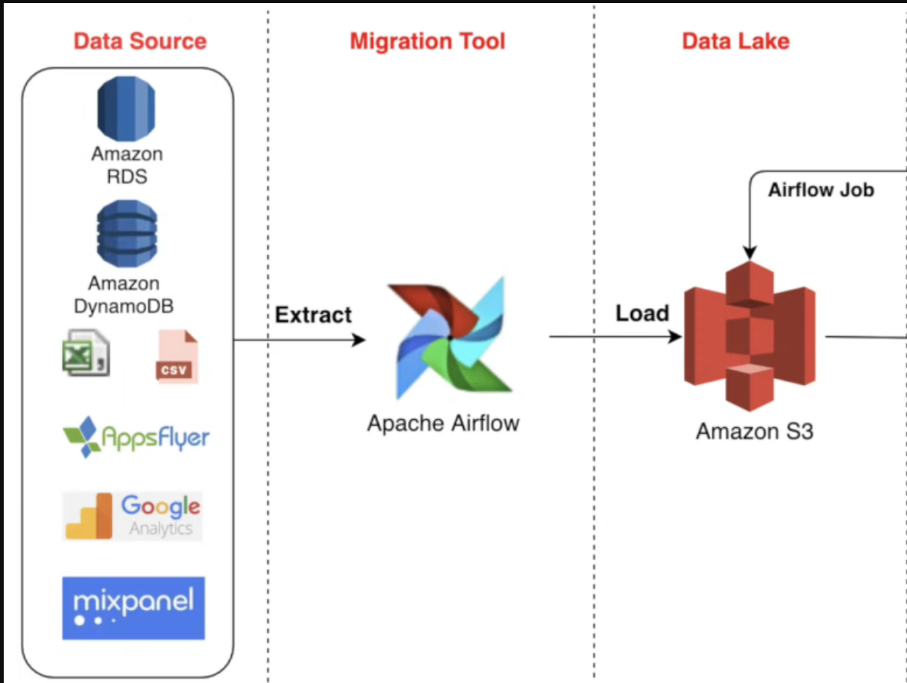

# Twitter Data Pipeline using Airflow and AWS

## Introduction 

We are going to use different technologies such as Python, Amazon Web Services (AWS).

## Architecture 


## Technology Used
- Programming Language - Python
- Open Source: Apache Airflow
- Amazon Web Service (AWS):

1. AWS EC2 (I use Ubuntu OS)
2. AWS S3 (Catch Data from Twitter API)
3. AWS IAM (Manage connection between EC2 and S3)


## Dataset Used
Twitter API

## Install requirement:
```
$ pip3 install pandas
$ pip3 install tweepy
$ pip3 install s3fs
```

## Connect to EC2 from local computer
When you create instance on EC2, remember to create Key pair and download it

Make sure you are on the directory where Key pair has downloaded

Run SSH client: 
From EC2> Instances> Instance ID> Connect> Copy SSH client

Copy SSH client and run it, example:
  ```
  $ ssh -i "key-pair-name.pem" ec2-user@ec2-12-345-67-890.ap-region.compute.amazonaws.com
  ```


Now you can download and install things you need on this virtual computer, such as: Apache Airflow and enviroment.

Remember edit security groups on EC2, modify AWS IAM to connect between EC2 and S3

Attach AWS S3 link to the script where you want to catch data
Example:
```
$ df.to_csv('s3://airflow-bucket-luan/refined_tweets.csv')  

```

## Connect to Airflow from EC2 Ubuntu

```
$ airflow standalone

```


